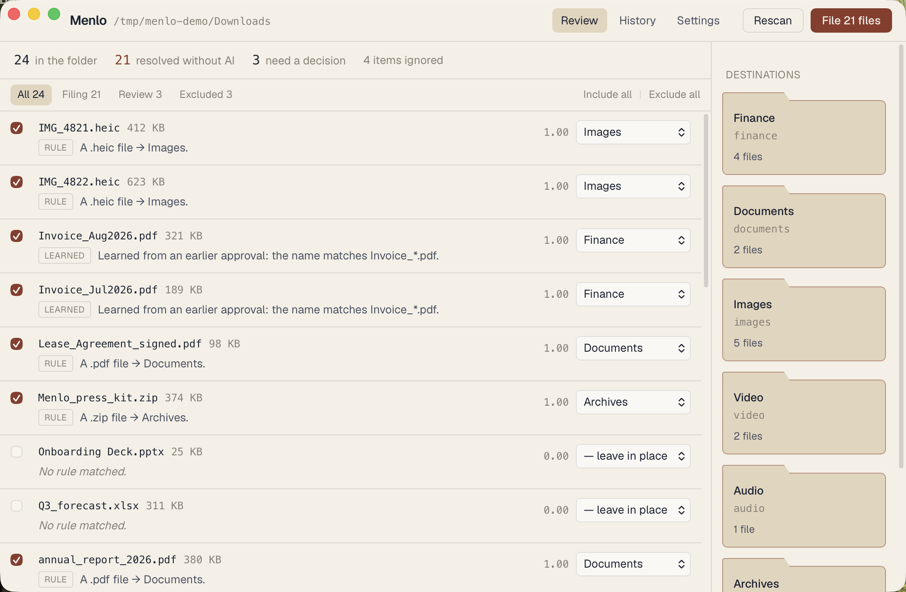

# Menlo



**Local-first, AI-powered file organiser for macOS. Runs on the CLI you already have.
No API key, no cloud.**

Menlo files the contents of a cluttered folder — usually `~/Downloads` — into
destinations you define, using natural-language rules you write per folder. It shows you
a plan. Nothing moves until you approve it, and every batch can be undone.

---

> ### No API key. It uses the CLI you already have.
>
> Menlo does not ship a model and does not ask for a key. It detects the agentic CLI
> already installed on your machine — Claude Code, Codex, Gemini CLI, opencode, or a
> local Ollama — and drives it in headless mode as a pure classifier.
>
> **Nothing leaves your device.** The Rust core makes no network calls at all; there is
> a CI check that fails the build if an HTTP client is ever added to it.
>
> No CLI installed? Menlo still works. Extension and glob rules resolve most of a
> typical Downloads folder with no inference at all, and the app tells you plainly that
> it is running in deterministic-only mode.

---

## Quickstart

```bash
git clone https://github.com/<you>/menlo.git
cd menlo
npm install
npm run tauri dev
```

Then, in about sixty seconds:

1. **Pick the folder to tidy.** `~/Downloads`, probably.
2. **Add two or three destinations.** For each one, write a brief in plain English —
   *"Invoices, receipts, tax forms, anything with an amount on it."*
   Name a folder `documents`, `images`, `video`, `audio`, `archives`, `code`,
   `spreadsheets`, `design`, `ebooks` or `fonts` and it gets extension routing for free.
3. **Scan.** Menlo proposes a destination for every file, with a reason and a confidence
   figure.
4. **Read the plan.** Change any destination, exclude anything you want left alone.
5. **File.** Then check History, where one click puts everything back.

## The safety model

- **The model never touches your files.** It receives text and returns text — no tools,
  no shell, no write access. Every move happens in Rust behind validation.
- **The model never returns a path.** It returns a key from a set the app supplied, and
  the app maps that key to a folder you added. Path injection is not filtered out; it is
  structurally impossible.
- **Nothing moves without an explicit approval,** and the plan you approve is
  re-validated before it executes.
- **Every batch is reversible.** Append-only journal, one-click revert, SHA-256 verified
  before anything is restored. A file you edited after filing is reported, not clobbered.
- **Refuses to touch what it should not:** `/`, `/System`, `/Library`, `/Applications`,
  `~/Library`, anything inside an `.app` bundle, symlinks, files open in another
  process, and installers unless you opt in. Destinations are canonicalised *after*
  symlink resolution and re-checked immediately before each move.

Collisions never overwrite — they get a ` (2)` suffix. Cross-volume moves copy, verify
the hash, and only then delete the original. Batches are capped at 500 files.

## Supported CLIs

| CLI | Status |
|---|---|
| Claude Code | Phase 2 |
| Codex | Phase 2 |
| Gemini CLI | Phase 2 |
| opencode | Phase 2 |
| Ollama (fully offline) | Phase 2 |
| *none installed* | **Works today** — deterministic rules only |

Menlo probes each binary's real `--help` output at runtime and records what headless
flags it actually supports, rather than hardcoding assumptions that go stale.

## Status

Phase 1 is complete: scanning, the deterministic and learned rule engine, the
plan-review screen, execution, and hash-verified undo. Phase 2 adds the CLI harness,
`kMDItemWhereFroms` origin extraction, and content excerpts.

## Development

See [CONTRIBUTING.md](CONTRIBUTING.md), [docs/ARCHITECTURE.md](docs/ARCHITECTURE.md),
and [docs/PROMPT_CONTRACT.md](docs/PROMPT_CONTRACT.md) — the last of which is the exact
interface between the app and whichever CLI is driving it.

## Licence

MIT.

---

### Why Menlo?

Named after the compulsively organised office aide from *Recess*, and set in the
monospace font of the same name.
