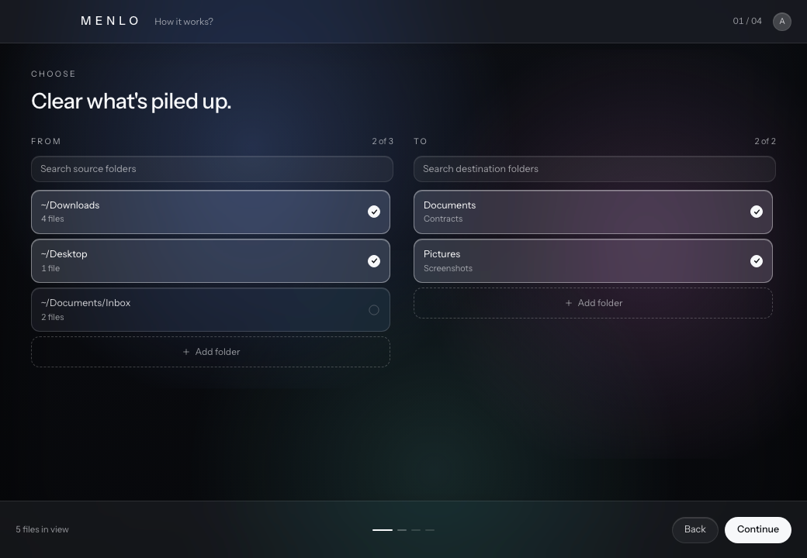
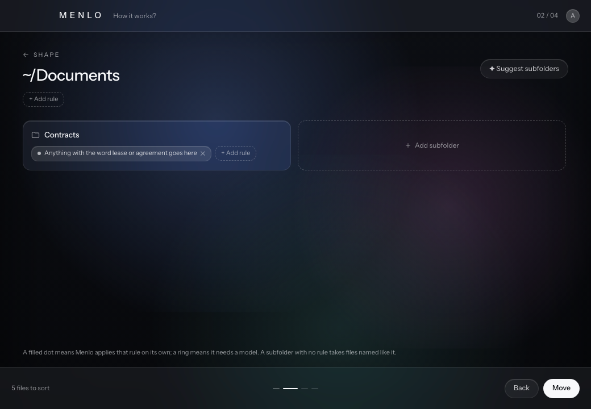
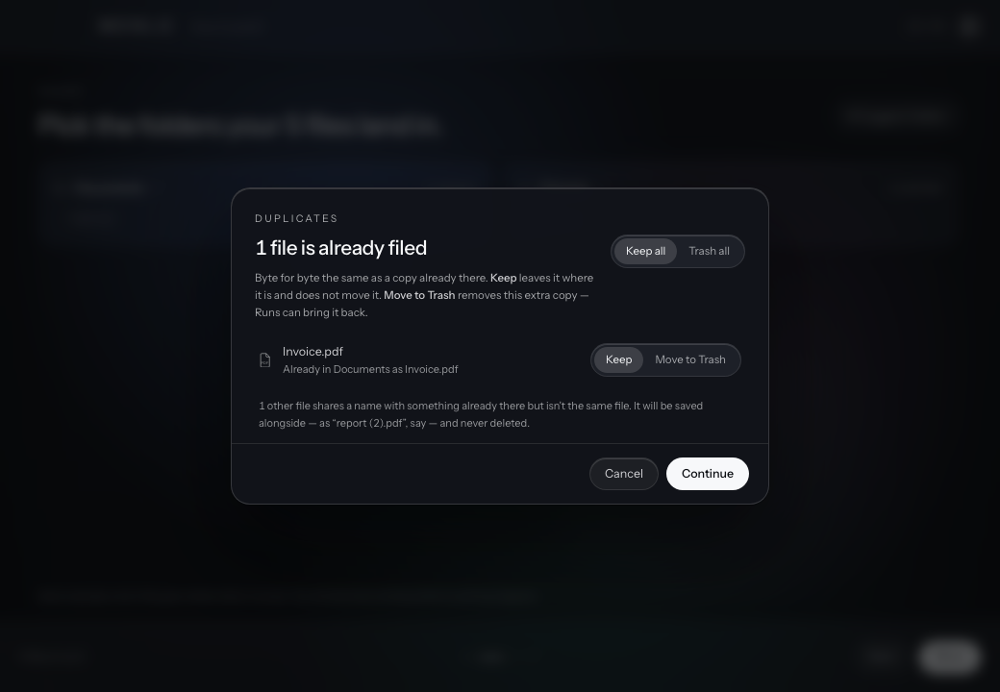
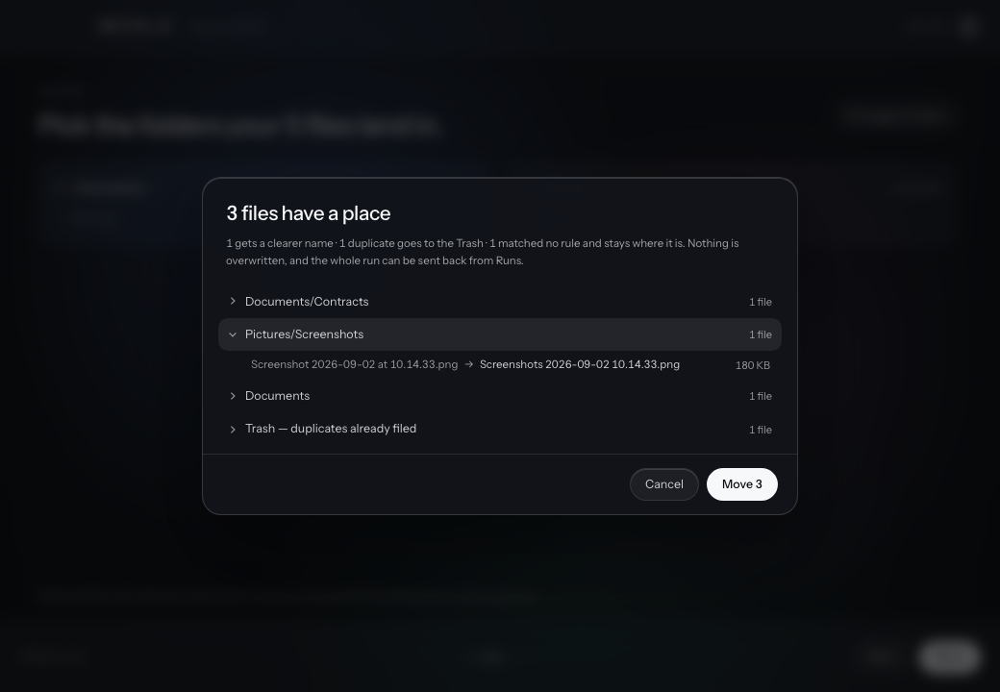
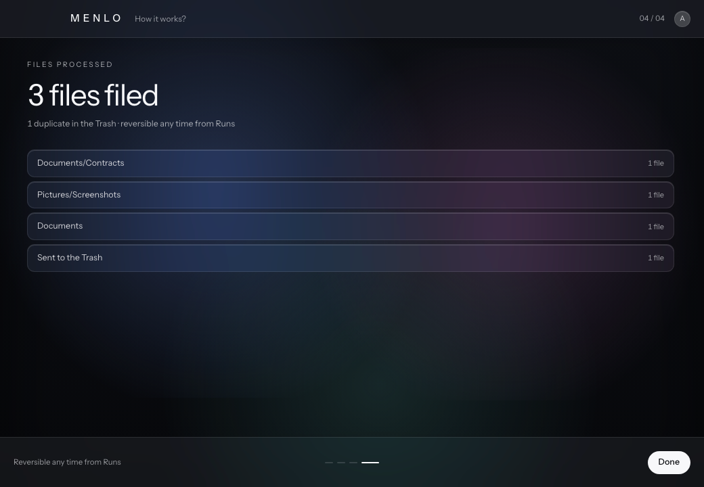
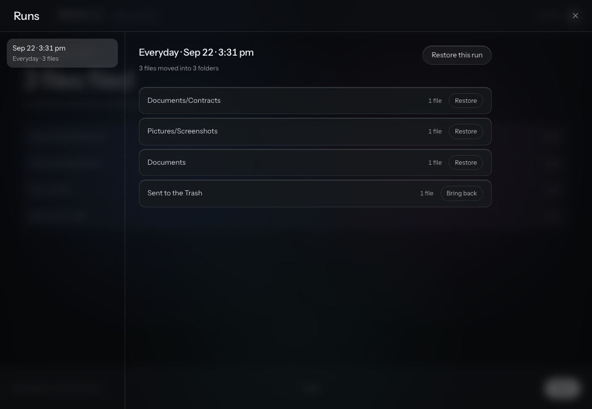
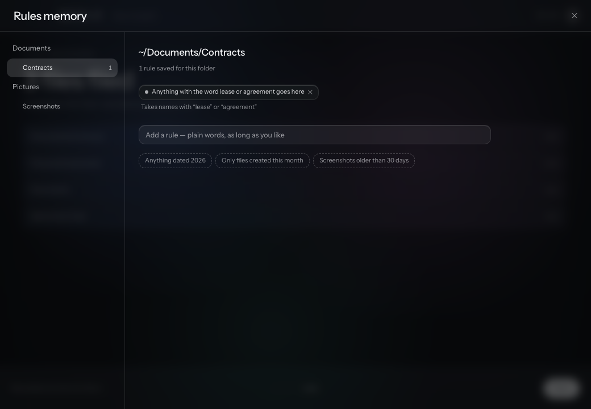
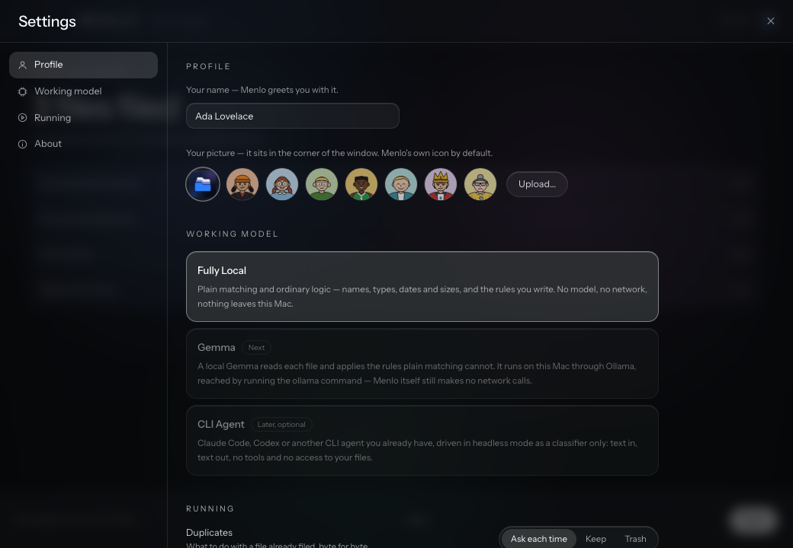

<p align="center">
  
</p>

<h1 align="center">Menlo</h1>

<p align="center">
  <strong>A calmer place for your files.</strong><br>
  Clears Downloads and Desktop into the folders you choose, by rules you write in plain words.<br>
  Local-first. No account, no cloud — nothing leaves your Mac.
</p>

<p align="center">
  <a href="https://github.com/mayanksagar26/menlo/releases/latest"><strong>Download for macOS</strong></a> ·
  <a href="#install">Install</a> ·
  <a href="#how-it-works">How it works</a> ·
  <a href="#writing-rules">Writing rules</a> ·
  <a href="#safety">Safety</a>
</p>

<p align="center">
  <a href="https://github.com/mayanksagar26/menlo/actions/workflows/ci.yml"></a>
  
  
</p>


Menlo takes the folders things pile up in — Downloads, Desktop, anywhere — and files
what is in them into the folders you actually use. You pick the folders, write rules
like *"anything with the word lease or agreement goes here"*, and Menlo shows you every
landing before a single file moves. Every run can be undone.

It works with **no AI at all**. Rules are read with ordinary matching — names, file
types, dates, sizes — and Menlo tells you plainly when a rule needs a model to apply.
A local model (Gemma, through Ollama) is next; a CLI agent like Claude Code will be an
option, never a requirement.

---

## Contents

- [Install](#install) — download, with Claude Code, or from source
- [How it works](#how-it-works)
- [Writing rules](#writing-rules)
- [Duplicates and renaming](#duplicates-and-renaming)
- [Safety](#safety)
- [Working models](#working-models)
- [Development](#development)
- [Roadmap](#roadmap)

---

## Install

<p align="center">
  
</p>

### Download

1. Download **`Menlo_0.1.0_aarch64.dmg`** from the
   [latest release](https://github.com/mayanksagar26/menlo/releases/latest).
2. Open it and drag **Menlo** onto **Applications**.
3. Open Menlo. The first time, macOS will stop it, because this build is signed ad-hoc
   rather than with a paid Apple Developer ID, so macOS does not recognise the developer:
   - **macOS 15 and later:** open **System Settings → Privacy & Security**, scroll to the
     message about Menlo, and click **Open Anyway**.
   - **macOS 14 and earlier:** right-click Menlo in Applications → **Open**, then
     **Open** again.

If macOS instead says the app *"is damaged"*, it has only been quarantined by the
download. Clear the quarantine with:

```bash
xattr -dr com.apple.quarantine /Applications/Menlo.app
```

The release build is for **Apple Silicon**. On an Intel Mac, build from source below.

### Let your coding CLI do it

If you have [Claude Code](https://claude.ai/code) or
[Codex CLI](https://github.com/openai/codex), open a terminal in the folder you want
the project to live in, start the CLI, and paste this:

```text
Clone https://github.com/mayanksagar26/menlo and set it up for me on macOS.

Do all of this:
1. Check I have the prerequisites: macOS 11+, the Xcode Command Line Tools,
   Node.js 22+, and Rust (stable, via rustup). If any are missing, install them
   and tell me what you installed.
2. git clone the repo and cd into it.
3. Run: npm install
4. Build the app: npm run tauri build
5. Copy Menlo.app from src-tauri/target/release/bundle/macos/ into /Applications
6. If macOS refuses to open it, clear the quarantine flag:
   xattr -dr com.apple.quarantine /Applications/Menlo.app
7. Launch it and tell me if it opened.

If any step fails, read the error, fix it, and continue. Report what you did.
```

The CLI asks before running each command, so you see exactly what it installs. The
steps are the same as building from source below. Menlo itself does not need the CLI
once it is installed.

### From source

You need **Rust** (stable), **Node 22+**, and the **Xcode Command Line Tools**
(`xcode-select --install`) — full Xcode is not required.

```bash
git clone https://github.com/mayanksagar26/menlo.git
cd menlo
npm install
npm run tauri build
open src-tauri/target/release/bundle/dmg/Menlo_0.1.0_*.dmg
```

To run it without building an app, use `npm run tauri dev`.

---

## How it works

A run is one pass through four stages. Nothing moves until the third.

### 1 · Choose

Pick the folders to clear and the folders things can land in. **Add folder** on either
side takes any folder on your Mac. On first launch Menlo sets itself up from the folders
you already have — Downloads and Desktop to clear; Documents, Pictures, Movies, Music and
Developer to file into, with their existing subfolders.



### 2 · Shape

Give folders rules in plain words, and step into a folder to shape its subfolders. A
subfolder with no rule takes files named like it — `Invoices 2026` catches
`Invoice_Aug2026.pdf`. Each rule shows whether Menlo can apply it on its own
(filled dot) or needs a model (ring).



### 3 · Move

Press **Move** and Menlo works out where everything goes. Files already filed, byte for
byte, are raised first — keep them where they are, or send the extra copy to the Trash.



Then the preview: every landing, every new name, before anything happens.



Files travel in one pass, with a counter per folder. **Stop** stops after the file in
flight — what landed stays, and nothing else is touched.

### 4 · Files processed

A receipt of what actually landed, read back from the journal of the run.



### Runs

Every run is kept. Send back a whole run, one folder of it, or just what it put in the
Trash. A file you have edited since is left alone rather than overwritten.



---

## Writing rules

Rules are sentences, stored exactly as you write them and read afresh on every run.
Nothing is tied to particular wording. Without a model, Menlo understands:

| It reads | For example |
|---|---|
| **Words in the name** — after *named*, *called*, *containing*, *with … in the name*, *read like*, *keep … together*, or in quotes | "Anything named invoice" · "Files with receipt in the name" · `"boarding pass"` |
| **File types** | "Put PDFs here" · "Photos" · "Videos" · "Spreadsheets" |
| **Screenshots** | "Screenshots" |
| **A year** | "Photos from 2025" |
| **A size** | "Videos bigger than 1 GB" · "Skip anything under 2 KB" |
| **An age** | "Screenshots older than 30 days" · "Only files created this month" |
| **Only / Skip** | "Only files over 10 MB" turns other files away |

Anything else is marked **Needs a model** and moves nothing — Menlo never guesses. The
honest gap today: the most natural phrasing, like *"Invoices go here"* or *"Tax stuff"*,
has no cue word yet, so it waits for a model. Say *"anything named invoice"* instead,
until that lands (see [Roadmap](#roadmap)).

Rules Memory shows every rule, by folder, with what Menlo understood from it:



How rules combine: a rule about names or types can send a file anywhere — *"lease or
agreement"* reaches Documents/Contracts even though the file is a PDF. A rule with only
a date, size or age can only choose *between the subfolders of the folder a file is
already going to*, so *"anything dated 2026"* on Documents/Invoices 2026 never pulls in
your 2026 holiday photos.

---

## Duplicates and renaming

**Duplicates.** A file is a duplicate only if it is byte-for-byte the same (SHA-256) as
one already in its folder, or as another file in the same run. You choose, per file:

- **Keep** — leave it where it is; it is not moved.
- **Move to Trash** — remove the extra copy. It goes to your Trash and into the run's
  journal, so Runs can bring it back.

A file that only *shares a name* with one already there is a different file. It is
moved alongside as `report (2).pdf` and never offered for deletion. Settings sets the
default: ask each time, keep, or trash.

**Renaming.** Names a tool chose — `Screenshot 2026-09-02 at 10.14.33`, `IMG_4821`,
`download (3)` — get a clearer one, but only when it says more than the old name. Filed
into Documents/Tax 2026, a screenshot becomes `Tax 2026 2026-09-02 10.14.33.png`. Filed
into plain Pictures it keeps its name, because "Pictures 2026-09-02" would say less.
A name you chose is never touched. Every rename is shown in the preview, and undoing a
run restores the original name.

---

## Safety

- **Nothing moves without you pressing Move,** and by default you see every landing
  first.
- **Nothing is overwritten.** A name clash gets a ` (2)` suffix.
- **Every run is reversible.** An append-only journal records each move, and a restore
  verifies each file's SHA-256 first. A file you edited since is reported, not clobbered.
- **Only identical copies can be trashed,** and both copies are re-hashed immediately
  before, so a file that changed after the preview is never removed.
- **Cross-volume moves** copy, verify the hash, and only then delete the original.
- **It refuses to touch** `/`, `/System`, `/Library`, `/Applications`, `~/Library`,
  anything inside an app bundle, symlinks, files open in another app, and installers
  unless you opt in. Paths are checked after symlink resolution, and again right before
  each move.
- **No network code.** The Rust core makes no network calls; CI fails the build if an
  HTTP client is ever added to it.
- **A model can never name a path.** When one is used, it picks a folder *key* from a
  list Menlo supplied; Menlo maps the key to a folder you added.

---

## Working models

Chosen in Settings.

| | What decides | Status |
|---|---|---|
| **Fully Local** | Ordinary matching and the rules you write. No model, no network. | **Works today** |
| **Gemma** | A local Gemma reads each file and applies the rules plain matching cannot, through Ollama on this Mac. | Next |
| **CLI Agent** | Claude Code, Codex or another CLI agent you already have, as a classifier only. | Later, optional |



---

## Development

```bash
npm install
npm run tauri dev          # the app, with hot reload

cargo test  --manifest-path src-tauri/Cargo.toml   # 134 Rust tests
npm run typecheck && npm test                      # TypeScript + unit tests
npm run test:e2e                                   # the whole flow in a browser
```

Worth knowing:

- **`src-tauri/tests/ipc.rs`** drives the real Tauri commands with the exact JSON the
  window sends, on real files in a sandboxed home.
- **`src-tauri/tests/duplicates.rs`** puts files in the Trash and brings them back,
  checking every file's contents by hash.
- **`e2e/`** runs the real window against a stubbed backend and asserts what it sends.
  `e2e/screens.spec.ts` also captures every screen into `test-results/screens/`.
- The app icon and installer artwork are drawn in `design/brand/` and rendered by
  `design/brand/build.sh`. The results are committed, so a normal build needs nothing
  extra.

More in [CONTRIBUTING.md](CONTRIBUTING.md), [docs/ARCHITECTURE.md](docs/ARCHITECTURE.md)
and [docs/PROMPT_CONTRACT.md](docs/PROMPT_CONTRACT.md). The design this is built from is
in [docs/design/](docs/design/HANDOFF.md).

---

## Roadmap

- **Gemma through Ollama** — for rules plain matching cannot read, and to name
  screenshots after what is in them. Reached through the `ollama` command line, so the
  Rust core stays free of network code.
- **Natural phrasing without a model** — reading *"Invoices go here"* the way it reads
  *"anything named invoice"*.
- **A menu-bar agent** — scheduled runs and a notification when a run finishes. Both are
  in Settings already, switched off until this lands.
- **Learning from your approvals** — every choice you confirm is labelled data. A small
  decision model such as [Laya](https://laya.convaiinnovations.com/), fine-tuned on it,
  could replace the model step entirely.
- **A notarised build**, so no right-click is needed on first open.

---

## Licence

MIT © Mayank Sagar

<sub>Named after the compulsively organised office aide in <em>Recess</em>.</sub>
